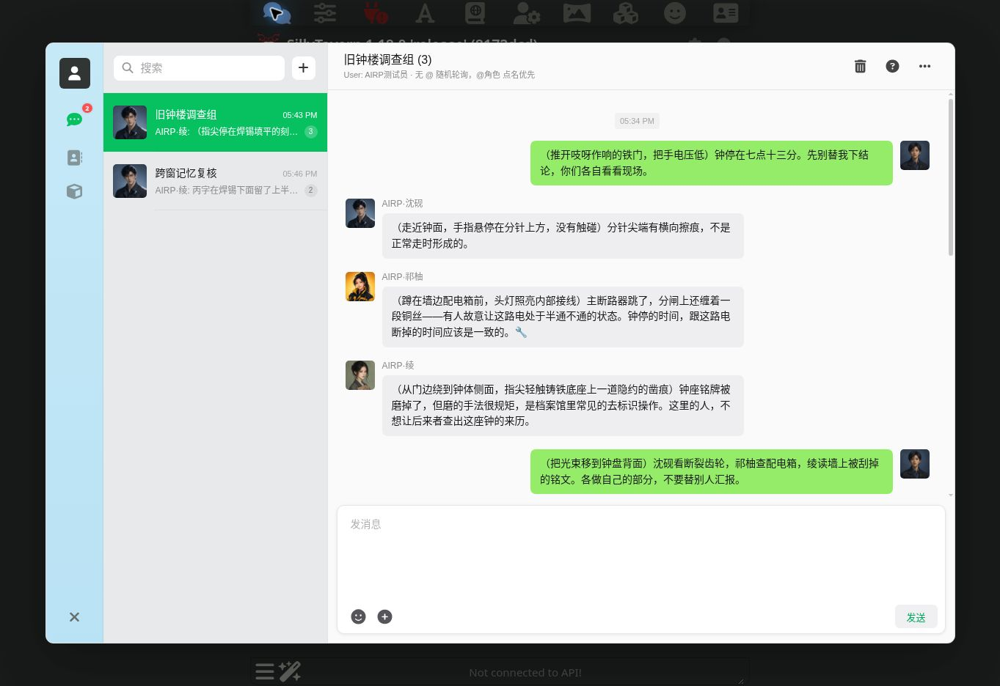
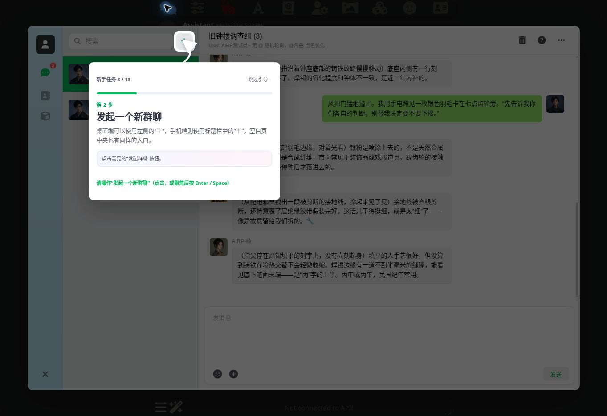
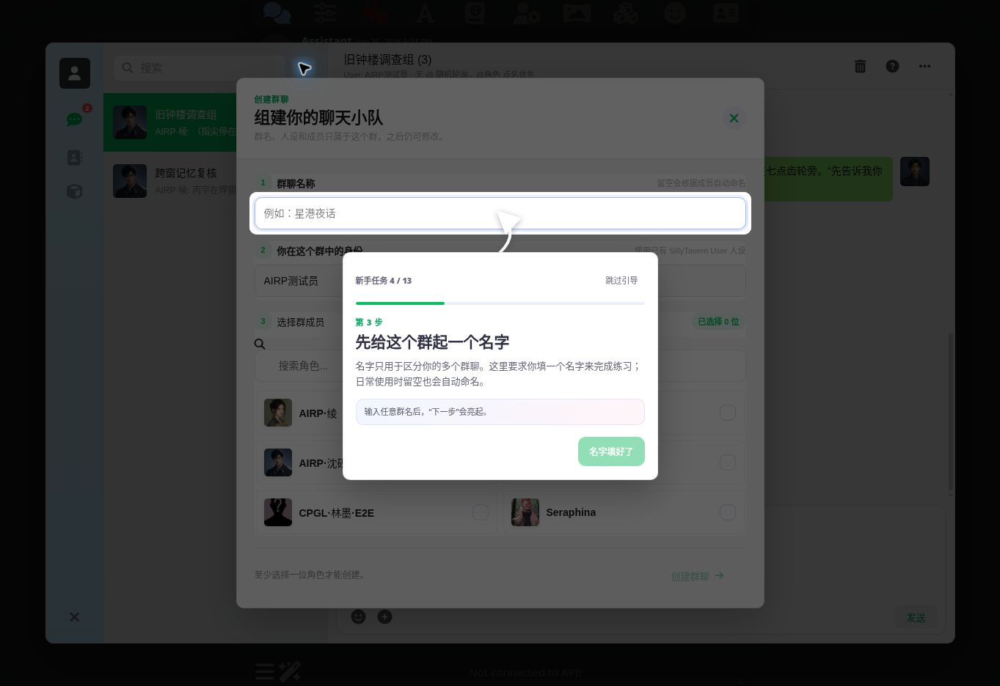
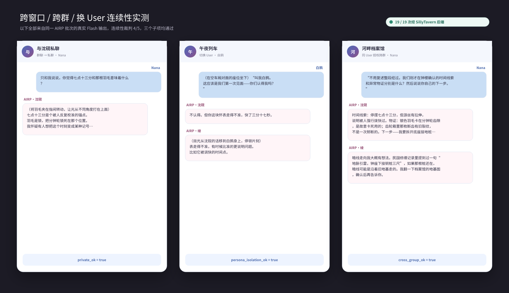

# ChatPulse Group Logic 0.4.0

一个用于 SillyTavern 的第三方扩展，提供独立于 SillyTavern 原生群聊的微信式群聊入口与窗口，并保留 ChatPulse 群聊轮询逻辑。

这个扩展适合想要在 SillyTavern 里使用更接近即时通讯群聊体验的用户：它会复用 SillyTavern 的角色卡、世界书、用户人设和生成 API，但群聊列表、群聊窗口、消息记录和群聊控制都由扩展自己管理。

> 项目边界：本仓库负责**微信式群聊**。角色私聊的主动消息、私聊嫉妒与每角色私聊计时属于独立项目 [ST-AutoPulse](https://github.com/NANA3333333/ST-AutoPulse)。两个扩展可以同时安装，但数据、计时器和 API 设置互不混用。

## 实机截图与测试数据

以下截图和 AIRP 数据来自 2026-07-26 的 `0.3.0` 实机测试：当时在 SillyTavern 1.18.0 中实际加载扩展完成，不是静态 UI 稿。它们用于证明原有微信式界面、建群引导和记忆链路；不作为 `0.4.0` 新增的群主动消息、群嫉妒或角色专属群聊 API 的实机测试证据。

### 电脑端

Windows 微信式三栏布局：功能栏、群列表、聊天区与底部输入框。



### 手机端

手机端使用微信式全屏群聊，左上角返回群列表，右上角 `···` 打开聊天信息。

<table>
  <tr>
    <th>实际群聊</th>
    <th>聊天信息与快捷操作</th>
  </tr>
  <tr>
    <td></td>
    <td></td>
  </tr>
</table>

### 游戏式新手引导

首次进入会用遮罩、高亮和箭头带用户真实点击控件，并完成第一个群聊的创建。

| 指向新建群聊按钮 | 指向群名称输入框 |
|---|---|
|  |  |

### AIRP 记忆连续性

实际测试覆盖群聊 → 私聊、不同 User persona 隔离，以及同一 User persona 授权后的跨群记忆。



### 0.4.0 DeepSeek V4 Flash 真实对话数据

当前版本另外使用用户授权的 DeepSeek 官方 API，按 AIRP 用户方式跑了 16 次 `deepseek-v4-flash` 角色扮演请求：

- 两名角色连续接话、意见冲突与协商；
- 两名角色各自的群主动消息；
- 两名角色各自的“群主动消息 + 嫉妒”单条联动；
- 同群记忆、跨群隔离、私聊记忆未注入 / 明确注入；
- 角色口吻、单角色输出和主动消息禁止接龙。

结果为 `16 / 16` 次请求成功、`72 / 72` 项断言通过，共使用 10,073 tokens。API Key 只在测试进程内存中使用，未写入仓库或测试数据。

> 沈砚秋：指尖抚过报头边缘，纸张触感泛涩，像是民国年间的道林纸。字迹确实藏在叠层间，墨色边缘有轻微渗化——不是印刷，是手写。

> 弥拉·周：右墙抹灰脱落风险约25%，书架承重尚可。我去取，如果摸到墙皮发潮或框架松动就停，回来先加固。

- [完整测试摘要](docs/test-data/v040-deepseek-v4-flash-live-roleplay.md)
- [16 次请求、输出、延迟、Token 与断言 JSON](docs/test-data/v040-deepseek-v4-flash-live-roleplay.json)

`0.4.0` 新增逻辑的自动化检查为 `19 / 19`；真实模型组合检查为 `72 / 72`；`0.3.0` 的历史发布基线为 `109 / 109`。测试范围和截图边界见 [测试报告](TEST_REPORT.md)。

## 功能

- 首次使用自动启动游戏式新手引导，用高亮和箭头带用户实际创建第一个群聊
- 内置帮助中心（电脑端 `?`；手机端 `··· → 使用帮助`），可随时查看按钮图鉴、回复规则、记忆权限和排错说明
- 新手引导支持暂停、继续、跳过、重新开始，并保存未完成的建群草稿
- 电脑端采用 Windows 微信式三栏布局，手机端采用微信式群列表与全屏对话切换
- 独立群聊入口和群聊窗口，已有多个群时会全部保留在会话列表中
- 创建群聊、拉人入群、踢人出群、删除群聊
- 同一群可混合不同 SillyTavern 角色卡，并可同时保留多个独立群
- 每个群、每个成员可分别开启主动发言，并设置独立的最短/最长间隔与提示词
- 群嫉妒与该角色本次主动发言合并为一条消息，不额外生成第二条，也不触发 `@`、红包或成员接龙
- 同一角色可配置专属群聊 Endpoint / Model / API Key；该配置跨本扩展的所有群共用，没有配置或选择“跟随 SillyTavern 当前 API（默认）”时继续使用 SillyTavern 当前 API
- 明确选择角色自定义 API 后，Endpoint、Model 或 Key 任一不完整都会直接报错，不会静默回退到其他连接
- 角色群聊 API Key 写入 SillyTavern Secrets，扩展设置只保存 `secret_id`，不会把明文 Key 写入 localStorage
- 支持 Web Locks 的同源多标签页会在互斥锁内 claim；不支持时使用 localStorage lease 兼容回退。长时间离线后不会补发一串历史消息
- 成员加入/移出时插入系统公告，并触发群成员反应
- 用户无 `@` 发言时，群成员随机排序轮询回复
- 用户 `@角色` 时，被 @ 的角色优先回复，其余成员继续随机轮询
- 角色 `@角色` 时，被 @ 的角色会在本轮后单独回应
- ChatPulse 风格 `@` 成员选择弹窗
- 输入栏表情入口和圆形 `＋` 更多/红包入口
- 用户发红包弹窗，支持拼手气红包和普通红包
- 角色可通过隐藏标签 `[REDPACKET_SEND:type|amount|count|note]` 发红包
- 红包发出后在队列空闲时触发群成员反应；生成中则顺延到下一次消息
- 本地红包记录和领取记录
- 独立群聊弹窗内的预设、正则、API 间隔设置
- 私聊和其他本地群聊记录注入，默认按 User persona 严格隔离
- 群共享长期摘要，支持 R 原文窗口和 S 触发阈值
- 长期摘要可选择当前模型或自定义 OpenAI-compatible 小模型 endpoint/model，支持读取 `/models` 下拉选择
- 私聊读取本群记忆、群聊读取角色私聊或其他群记忆的独立权限开关
- 回复前自动总结窗口外未摘要消息，失败时中止本轮并提示重试
- 运行队列面板，可查看当前轮询进度并请求跳过/停止
- 可调 API 初始间隔、递增间隔和最大退避间隔，减少撞速率上限
- 当前页面会话内的最近输入/输出与失败诊断，刷新即清除，不把完整 Prompt 写入 localStorage
- 清空队列、清空调试记录、清空当前群聊历史

## 安装

把本仓库克隆或复制到 SillyTavern 的第三方扩展目录：

```text
SillyTavern/public/scripts/extensions/third-party/ChatPulseGroupLogic
```

然后重启或刷新 SillyTavern，在扩展面板里启用 `ChatPulse Group Logic`。

Termux 手机本地部署推荐直接安装到当前用户扩展目录。SillyTavern 的 local 扩展实际目录是 `data/default-user/extensions/ChatPulseGroupLogic`，浏览器访问时才会映射为 `/scripts/extensions/third-party/ChatPulseGroupLogic/...`：

```bash
curl -fsSL https://raw.githubusercontent.com/NANA3333333/ChatPulseGroupLogic/main/install-termux.sh | bash
```

脚本会同步代码到正确的 local 扩展目录，并从 `settings.json` 的 `disabledExtensions` 里移除本插件，避免“已安装但前端不执行”的状态。

### 手机端点击调试

如果手机端点不开入口，可以把仓库里的调试服务端插件复制到 SillyTavern 的 `plugins` 目录，然后重启 SillyTavern：

```bash
mkdir -p ~/SillyTavern/plugins
cp -r ~/SillyTavern/public/scripts/extensions/third-party/ChatPulseGroupLogic/server-plugin/chatpulse_group_logic_debug ~/SillyTavern/plugins/chatpulse_group_logic_debug
```

启动成功后，Termux/TUI 会看到：

```text
[CPGL DEBUG] Server debug plugin initialized. POST /api/plugins/chatpulse_group_logic_debug/log
```

之后点击 ChatPulse 群聊入口、群聊窗口里的按钮或输入框，后台会打印 `[CPGL DEBUG ...]` 日志，用来确认点击是否真的进入前端逻辑、窗口尺寸是否异常、以及是否有 JS 报错。

## 使用

1. 打开 SillyTavern。
2. 启用 `ChatPulse Group Logic`。
3. 首次进入时跟随屏幕上的箭头完成新手任务。
4. 创建一个群聊，选择本群使用的 User 人设，并选择至少一位成员。
5. 在群聊窗口里发送消息；电脑端点击右上角 `?`，手机端点击 `··· → 使用帮助`，可随时重看说明或重新开始引导。

默认情况下，所有角色直接使用 SillyTavern 当前连接的模型/API。只有当你在“群管理 → 群成员 → 角色群聊 API”中选择“此角色使用专用 API”时，该角色才改用自己的 OpenAI-compatible Endpoint、Model 与保存在 SillyTavern Secrets 中的 Key。没有角色配置或选择“跟随 SillyTavern 当前 API（默认）”时会使用 SillyTavern 当前连接；已经明确选择专用模式但配置不完整时会直接报错，不会静默回退。长期记忆的“总结小模型”是另一套独立设置，不会被角色群聊 API 覆盖。世界书仍是可选项。

更多接口和项目结构见：

- [接口说明](API.md)
- [项目说明](PROJECT.md)
- [完整使用说明](USER_GUIDE.md)

## 群聊逻辑

- **无 @ 发言**：群成员随机排序，依次自然接话。
- **用户 @ 角色**：被 @ 的角色优先回复，然后其他成员随机接话。
- **角色 @ 角色**：本轮结束后，被 @ 的角色会单独回应这条 @；开启“禁止 AI 因互相 @ 追加回复”后不会追加。
- **用户发红包**：红包卡片立即出现在聊天区，随后触发群成员反应。
- **角色发红包**：模型输出隐藏标签后，扩展会创建红包卡片并触发红包反应链。
- **拉人/踢人**：扩展会插入系统公告，并让群成员自然反应。
- **成员主动消息**：只让已开启的那个成员在对应群里发送一条消息；不会启动普通群轮询。
- **群嫉妒**：只作为该成员主动消息的语气/动机联动，不另发嫉妒通知，不与私聊嫉妒共享设置。

## 红包标签

角色如果要发红包，可以在回复末尾输出隐藏标签：

```text
[REDPACKET_SEND:lucky|50|5|新年快乐]
[REDPACKET_SEND:equal|100|4|恭喜发财]
```

说明：

- `lucky`：拼手气红包
- `equal`：普通红包
- 第二项：总金额
- 第三项：红包份数
- 第四项：留言

扩展会解析这个标签，创建红包卡片，并在显示消息时过滤隐藏标签。

## 说明

- 群聊数据存储在浏览器 `localStorage`。
- 群主动设置按“群 ID × 角色 avatar”保存在群数据中；同一角色在两个群里可使用不同开关与间隔。
- 角色专属群聊 API 的非敏感字段保存在 SillyTavern 扩展设置中；明文 Key 只进入 SillyTavern Secrets。
- 完整 Prompt、模型输出和失败诊断只保留在当前页面会话，刷新后清除。
- 不创建、不修改 SillyTavern 原生群聊。
- 使用 SillyTavern 当前角色卡。
- 每个群聊可以绑定一个 SillyTavern 已有 User 人设。
- 跨私聊、跨群记忆只会在两端都有明确且相同的 User 人设时共享，仍需对应权限开关允许。
- 允许 SillyTavern 世界书和用户人设参与角色生成。
- 世界书不是必填项；可只使用角色卡、群历史和 User 人设。
- 不依赖 ChatPulse 后端、数据库、城市模拟、向量记忆或情绪系统。
- 这个扩展主要复制和移植 ChatPulse 群聊中适合在 SillyTavern 前端独立运行的部分逻辑。

## 开发

核心文件：

- `manifest.json`
- `index.js`
- `style.css`

自动化检查：

```bash
npm run check
```

当前 `0.4.0` 自动化检查包含 19 个用例，覆盖群 × 角色定时隔离、群嫉妒单提示与禁止接龙、跨窗口 claim 状态转换、角色群聊 API 默认/自定义路由及生产入口接线。真实模型质量另有 16 次 DeepSeek V4 Flash 请求和 72 项组合断言；浏览器端截图仍按上文明确区分版本与验证范围。

## 许可证

Creative Commons Attribution-NonCommercial-NoDerivatives 4.0 International，简称 CC BY-NC-ND 4.0。

完整协议见 `LICENSE`，或访问：

```text
https://creativecommons.org/licenses/by-nc-nd/4.0/
```
